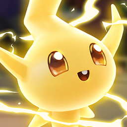

# Inner Spark

 <!-- TODO: add the key art image at Docs/key_art.png -->

A puzzle game on a printed circuit board. Guide **Sparky**, a little spark of electricity, along copper
traces from the Start plug to the Goal. Flip the board over through vias, toggle switches to open
gates, collect every data pickup to unlock the goal, and carry the right pass through pass locks.

## Team
<!-- TODO: confirm names and roles -->
| Name | Role |
|---|---|
| Tung Nguyen | Game design, level design |
| Truong Quang Nghia | Programming |
| Andrii | Art (3D models, VFX, UI) |
| Babar | TODO |

## Engine & language
- **Unity 6.3 LTS** (6000.3.12f1), Universal Render Pipeline
- **C#**
- Target: Windows (DirectX 12); opens in a resizable 1920×1080 window (the UI scales with the window)

## How to launch
1. Download and unzip the build.
2. Run **`Inner Spark.exe`** <!-- TODO: exe name follows Player Settings > Product Name -->.
   No Unity installation needed.

### Controls
| Action | Keyboard / mouse | Gamepad |
|---|---|---|
| Move (8 directions) | WASD / Arrow keys | Left stick / D-pad |
| Interact: flip board on a via, use a switch, take a pass | Space / Enter | South button |
| Restart level | R / Restart button | Select |
| Pause | Esc / Pause button | Start |
| Inspect the board | Hold left mouse + drag | — |
| Menus | Mouse, or Arrow keys + Enter | D-pad + South |

## Known issues
<!-- TODO: keep this up to date before each build upload -->
- Audio still needs balancing; some sounds are not in yet (switch, travel, menu music, gate close).
- No in-game volume sliders yet.
- Some art is placeholder (pass lock "unlocked" look, parts of the UI).
- Levels can't be lost — a stuck player uses Restart (R).

## AI-generated content
<!-- TODO: every team member adds their own AI usage here -->
| Tool | Type of content | Context / usage |
|---|---|---|
| Claude (Claude Code, Anthropic) | Code | Gameplay and tool scripts written with the team's direction: Level Editor tools (paint, link, data, pass tools, validation), Sparky character controller and animation sequencing, switch / gate / data / pass mechanics, audio manager, screen fades and stage intro system, progress save, ending screen, UI scaling; bug fixes and merge conflict resolution. |
| Claude (Claude Code, Anthropic) | Documentation | Project docs (`DESIGN.md`, `PROGRESS.md`, this README draft), asset setup guides. |
| TODO | TODO | TODO (e.g. any AI-assisted art, text, dialog, or code by other members) |

## Credits
<!-- TODO: verify every third-party asset and its licence -->
- 3D models, textures, VFX and UI art: Andrii (team).
- Music and sound effects: TODO (who made them / source + licence).
- Room / town scene props: appear to be **Kenney** asset kits (kenney.nl, CC0) — TODO confirm which kits.
- Font **Upheaval** (`upheavtt.ttf`) — TODO confirm author and licence.
- Font **Liberation Sans** (TextMesh Pro default) — SIL Open Font License.
- Built with Unity and TextMesh Pro.

## Project structure
- `Assets/Script/` — game code (`PCB/` gameplay + `PCB/Editor/` level tools, `UI/`, `Audio/`)
- `Assets/PCB/` — levels (`Levels/`), Level List, theme, prefabs, dialogs, sound bank
- `Assets/Import Asset/` — imported art, sounds, VFX
- `Assets/Scenes/` — `MainMenu`, `SampleScene` (gameplay), `Ending`
- `DESIGN.md` — design & code reference · `PROGRESS.md` — development log
